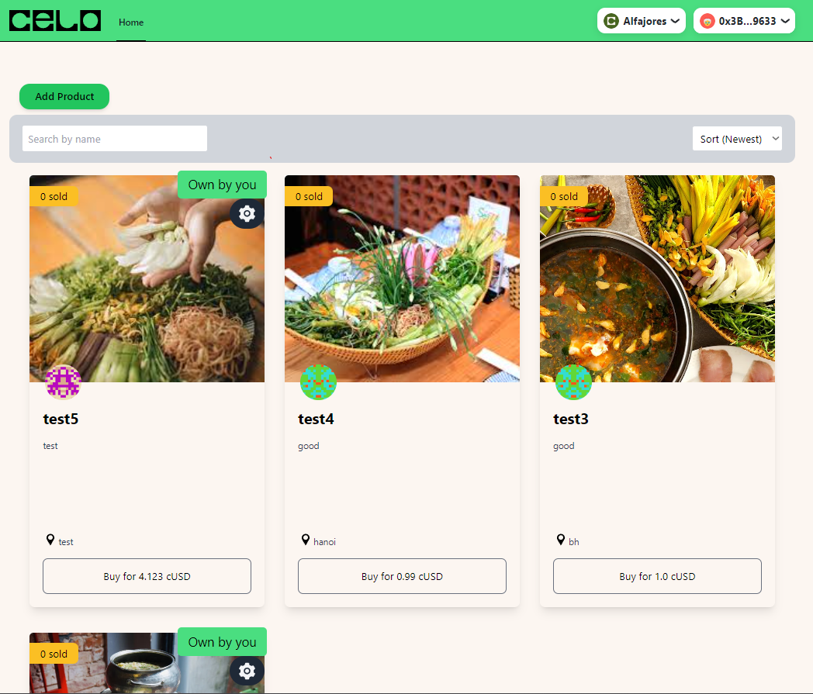

# Celo-FrontEnd-101
Live Demo: 



# Desciption
Welcome to Celo FrontEnd 101, a web application enable user to view, buy, add, update and delete their own product in the marketplace. This project was built as part of a coding challenge and serves as a showcase for my coding abilities.

# Feature
1. View list of products in the marketplace
2. Sort product by creating day
3. Search for products by name 
4. Add new products
5. Buy product
6. Edit or delete your own product

# Tech Stack
This web aplication uses the following tech stack:
- [Solidity](https://docs.soliditylang.org/) - A programming language for Ethereum smart contracts.
- [React](https://reactjs.org/) - A JavaScript library for building user interfaces.
- [Typescript](https://www.typescriptlang.org) - a strongly typed programming language that builds on JavaScript.
- [Rainbowkit-celo](https://docs.celo.org/developer/rainbowkit-celo) - RainbowKit is a React library that makes it easy to add wallet connection to dapp.
- [Wagmi](https://wagmi.sh) - wagmi is a collection of React Hooks containing everything you need to start working with Ethereum
- [Hardhat](https://hardhat.org/) - A tool for writing and deploying smart contracts.
- [TailwindCss](https://tailwindcss.com) - A CSS framework that dress up webpage.

# Installation
To run the application locally, follow these steps:

1. Clone the repository to your local machine using: ``` git clone https://github.com/Ganzzi/Celo-FrontEnd-101.git ```
2. Move into react-app folder: ``` cd Celo-FrontEnd-101/packages/react-app ```
3. Install: ``` npm install ``` or ``` yarn install ```
4. Start: ``` npm run dev ```
5. Open the application in your web browser at ``` http://localhost:3000 ```

# Usage
1. Install a wallet: [MetamaskExtensionWallet](https://chrome.google.com/webstore/detail/metamask/nkbihfbeogaeaoehlefnkodbefgpgknn?hl=en).
2. Create a wallet.
3. Go to [https://celo.org/developers/faucet](https://celo.org/developers/faucet) and get tokens for the alfajores testnet.
4. Switch to the alfajores testnet.
5. Connect yor wallet to the app.
6. Create a product.
7. Create a second account in your extension wallet.
8. Buy product with secondary account.
9. Check balance (Currently it is imposible to get cUSD from celo faucet, so buy product function will not success at all).
10. Add another product.
11. Search product in the marketplace by name.
12. Sort product by creating day.
13. Update the price of a product that you own.
14. Delete the sale of a product you own.

# Contributing
1. Fork this repository
2. Create a new branch for your changes: git checkout -b my-feature-branch
3. Make your changes and commit them: git commit -m "feat: create new feature"
4. Push your changes to your fork: git push origin my-feature-branch
5. Open a pull request to this repository with a description of your changes

Please make sure that your code follows the Solidity Style Guide and the React Style Guide. You can add tests for any new features or changes, also please make the front-end more friendly. I welcome any contributions or feedback on this project!
